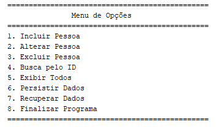

## Cadastro com Java

Implementação de um cadastro de clientes em modo texto, com persistência em arquivos, baseado na tecnologia Java.




## Configuração

### Configuração de variáveis

É necessário fazer a configuração de acesso ao MongoDB no arquivo `.env.local`:

```bash
MONGODB_URI = <Aqui você coloca as informações de acesso ao banco mongodb>
URL = http://localhost:3000
```
A variável URL deve ficar desse jeito pois executei os comandos localmente. 

### Informações adicionais

Foi utilizada um database chamado  `catalogo` e uma collection chamada  `livro`

### Execute o Next.js no modo desenvolvimento

```bash
npm install
npm run dev

# or

yarn install
yarn dev
```
